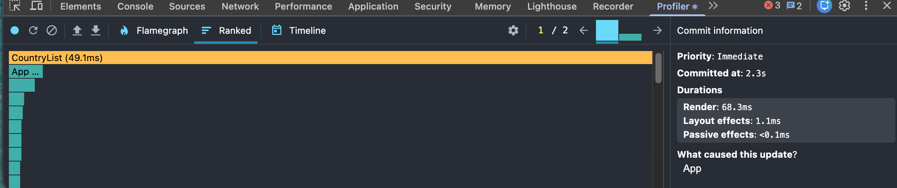
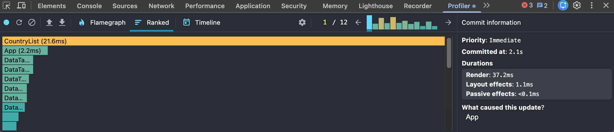
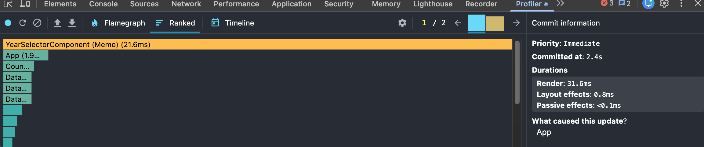
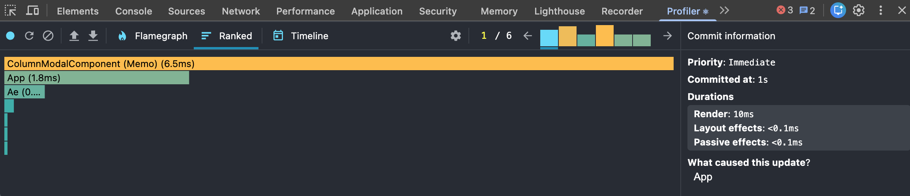

# Performance Optimization Report

## Baseline Measurements

### Interaction A: Sort countries

- **Commit duration**: 3 s
- **Render duration**: 222.7 ms
- **Screenshot**: 

### Interaction B: Search countries

- **Commit duration**: 3.3 s
- **Render duration**: 129.3 ms
- **Screenshot**: 

### Interaction C: Change year

- **Commit duration**: 2.6 s
- **Render duration**: 209.6 ms
- **Screenshot**: 

### Interaction D: Toggle column

- **Commit duration**: 1 s
- **Render duration**: 211.2 ms
- **Screenshot**: 

## Optimized Measurements

### Interaction A: Sort countries

- **Commit duration**: 2.3 s
- **Render duration**: 68.3 ms
- **Screenshot**: 

### Interaction B: Search countries

- **Commit duration**: 2.1 s
- **Render duration**: 37.2 ms
- **Screenshot**: 

### Interaction C: Change year

- **Commit duration**: 2.4 s
- **Render duration**: 31.6 ms
- **Screenshot**: 

### Interaction D: Toggle column

- **Commit duration**: 1 s
- **Render duration**: 10 ms
- **Screenshot**: 

## Summary of Improvements

| Interaction      | Baseline (ms) | Optimized (ms) | Improvement |
| ---------------- | ------------- | -------------- | ----------- |
| Sort countries   | 222.7         | 68.3           | 69.3 %      |
| Search countries | 129.3         | 37.2           | 71.2 %      |
| Change year      | 209.6         | 31.6           | 84.9 %      |
| Toggle column    | 211.2         | 10             | 95.3 %      |
| **Average**      | **193.2**     | **36.8**       | **80.9%**   |
