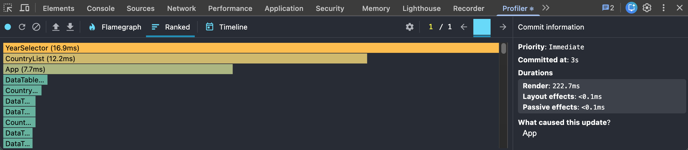
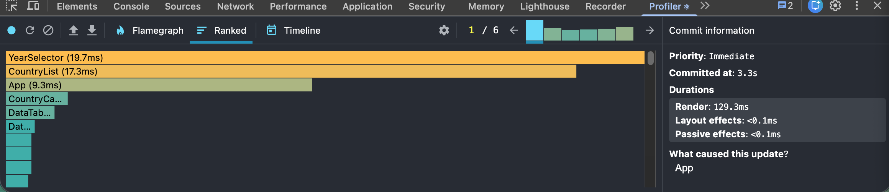
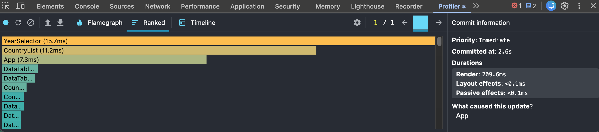
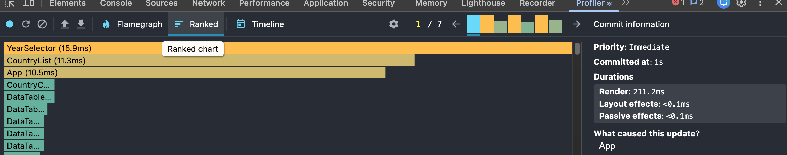

# Performance Optimization Report

## Baseline Measurements

### Interaction A: Sort countries

- **Commit duration**: 3 s
- **Render duration**: 222.7 ms
- **Screenshot**: 

### Interaction B: Search countries

- **Commit duration**: 3.3 s
- **Render duration**: 129.3 ms
- **Screenshot**: 

### Interaction C: Change year

- **Commit duration**: 2.6 s
- **Render duration**: 209.6 ms
- **Screenshot**: 

### Interaction D: Toggle column

- **Commit duration**: 1 s
- **Render duration**: 211.2 ms
- **Screenshot**: 

## Optimized Measurements

### Interaction A: Sort countries

- **Commit duration**: \_\_\_ s
- **Render duration**: \_\_\_ ms
- **Screenshot**: 

### Interaction B: Search countries

- **Commit duration**: \_\_\_ s
- **Render duration**: \_\_\_ ms
- **Screenshot**: 

### Interaction C: Change year

- **Commit duration**: \_\_\_ s
- **Render duration**: \_\_\_ ms
- **Screenshot**: 

### Interaction D: Toggle column

- **Commit duration**: \_\_\_ s
- **Render duration**: \_\_\_ ms
- **Screenshot**: 

## Summary of Improvements

| Interaction      | Baseline (ms) | Optimized (ms) | Improvement |
| ---------------- | ------------- | -------------- | ----------- |
| Sort countries   | \_\_\_        | \_\_\_         | \_\_\_%     |
| Search countries | \_\_\_        | \_\_\_         | \_\_\_%     |
| Change year      | \_\_\_        | \_\_\_         | \_\_\_%     |
| Toggle column    | \_\_\_        | \_\_\_         | \_\_\_%     |
| **Average**      | **\_\_\_**    | **\_\_\_**     | **\_\_\_%** |
